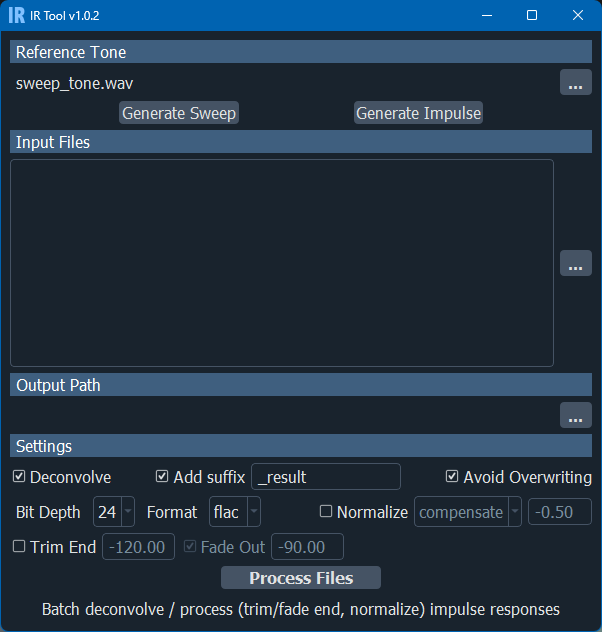

# IR Tool

Impulse Response tool

Batch deconvolve and process (trim / fade end, gain compensate / normalize) impulse responses

Generate test tone (sweep and impulse click) to use for deconvolution and recording

Supports wav, flac and aif formats for input and output

## Installation

This project was developed and tested with Python 3.12.7

Additional required packages :

* PyQt5
* numpy
* soundfile
* sounddevice
* qdarkstyle

## Usage

Execute ir_tool_UI.pyw

File and directory fields support drag and drop

Hold mouse cursor over widgets to display tool tips

Most widgets feature context actions with the right mouse button

## License

MIT License

Copyright (c) 2024 Michel 'Mitch' Pecqueur

Permission is hereby granted, free of charge, to any person obtaining a copy of this software and associated
documentation files (the "Software"), to deal in the Software without restriction, including without limitation the
rights to use, copy, modify, merge, publish, distribute, sublicense, and/or sell copies of the Software, and to permit
persons to whom the Software is furnished to do so, subject to the following conditions:

The above copyright notice and this permission notice shall be included in all copies or substantial portions of the
Software.

THE SOFTWARE IS PROVIDED "AS IS", WITHOUT WARRANTY OF ANY KIND, EXPRESS OR IMPLIED, INCLUDING BUT NOT LIMITED TO THE
WARRANTIES OF MERCHANTABILITY, FITNESS FOR A PARTICULAR PURPOSE AND NONINFRINGEMENT. IN NO EVENT SHALL THE AUTHORS OR
COPYRIGHT HOLDERS BE LIABLE FOR ANY CLAIM, DAMAGES OR OTHER LIABILITY, WHETHER IN AN ACTION OF CONTRACT, TORT OR
OTHERWISE, ARISING FROM, OUT OF OR IN CONNECTION WITH THE SOFTWARE OR THE USE OR OTHER DEALINGS IN THE SOFTWARE.