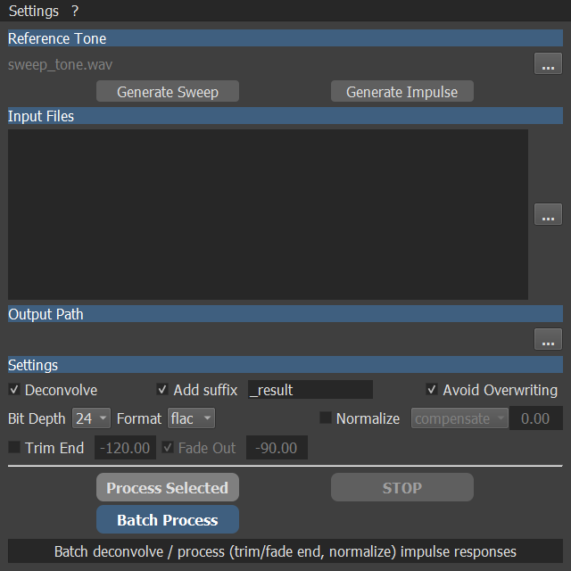

# IR Tool


**Impulse Response tool**

- Batch deconvolve and process (trim / fade end, gain compensate / normalize) impulse responses
- Generate test tone (sweep and impulse click) to use for deconvolution and recording
- Supports wav, flac and aif formats for input and output



### UI features

- File and directory fields support drag and drop<br/>
- Hold mouse cursor over widgets to display tool tips<br/>
- Most widgets feature context actions with the right mouse button<br/>

## Installation

**Prebuilt executables are available in the releases<br/>
Python installation is not required to use them<br/>**
Though, they may or may not be a bit behind this repository especially on macOS<br/>

This project was developed and tested with `Python 3.12.10`<br/>
However, it should be possible to run it and build it with another later Python version
_(Building and running seems to work fine with Python 3.14.2 on Windows)_

Additional required packages :

- PyQt5
- numpy
- soundfile
- sounddevice
- platformdirs

### Clone repository, create venv and install the required packages

Open a terminal from a directory of your choice

#### Linux and macOS

```
git clone https://github.com/robotmitchum/ir_tool.git
cd ir_tool
python3 -m venv .venv
source .venv/bin/activate
pip3 install -r requirements.txt
```

#### Windows

```
git clone https://github.com/robotmitchum/ir_tool.git
cd ir_tool
python -m venv .venv
.venv\Scripts\activate
pip install -r requirements.txt
```

## Execute ir_tool_UI.py

Open a terminal from the cloned project directory

#### Linux and macOS

```
source .venv/bin/activate
python3 -m ir_tool_UI
```

#### Windows

```
.venv\Scripts\activate
python -m ir_tool_UI
```

## Or build a native executable

A build procedure is provided with this package<br/>

The build_exe script runs a Python helper that reads a .json config describing the PyInstaller options<br/>
This allows keeping build settings editable and cross-platform<br/>

Open a terminal from the cloned project directory

#### Linux and macOS

Install pyinstaller package<br>
_(if you installed the project using requirements.txt you can skip this step, pyinstaller is already there)_

```
source .venv/bin/activate
pip3 install pyinstaller
```

Build the executable with pyinstaller

```
chmod +x build_exe.sh
./build_exe.sh
```

#### Windows

Install pyinstaller package<br>
_(if you installed the project using requirements.txt you can skip this step, pyinstaller is already there)_

```
.venv\scripts\activate
pip install pyinstaller
```

Build the executable with pyinstaller

Simply double-click on **build_exe.cmd** or type

```
build_exe.cmd
```

Let the process cook...<br/>

When completed, the executable will be found in the `dist/ir_tool` subdirectory<br/>

The following assets should also be bundled in `ir_tool` :

- sweep_tone.wav _(default 4 seconds sweep tone at 48 Khz and in floating point format you can use for recording)_
- deconvolution_examples _(optional but neat to test if everything is working)_

An archive of the `ir_tool` directory will also be found in `dist` - this is the same file I release on this page
in `releases`</br>
If you don't need it, it can be safely deleted

Copy this entire `ir_tool` directory to a location of your choice<br/>

- Linux : I recommend _~/user_name/opt_
- macOS : In your _Applications_ folder
- Windows : typically in _C:/Program Files_ or in your user directory

## Install desktop (Linux only)

This assumes the executable is located in *~/user_name/opt/ir_tool* or the bash script won't work<br/>

From the cloned project directory

```
chmod +x install_desktop.sh
./install_desktop.sh
```

## License

MIT License

Copyright (c) 2024 Michel 'Mitch' Pecqueur

Permission is hereby granted, free of charge, to any person obtaining a copy of this software and associated
documentation files (the "Software"), to deal in the Software without restriction, including without limitation the
rights to use, copy, modify, merge, publish, distribute, sublicense, and/or sell copies of the Software, and to permit
persons to whom the Software is furnished to do so, subject to the following conditions:

The above copyright notice and this permission notice shall be included in all copies or substantial portions of the
Software.

THE SOFTWARE IS PROVIDED "AS IS", WITHOUT WARRANTY OF ANY KIND, EXPRESS OR IMPLIED, INCLUDING BUT NOT LIMITED TO THE
WARRANTIES OF MERCHANTABILITY, FITNESS FOR A PARTICULAR PURPOSE AND NONINFRINGEMENT. IN NO EVENT SHALL THE AUTHORS OR
COPYRIGHT HOLDERS BE LIABLE FOR ANY CLAIM, DAMAGES OR OTHER LIABILITY, WHETHER IN AN ACTION OF CONTRACT, TORT OR
OTHERWISE, ARISING FROM, OUT OF OR IN CONNECTION WITH THE SOFTWARE OR THE USE OR OTHER DEALINGS IN THE SOFTWARE.