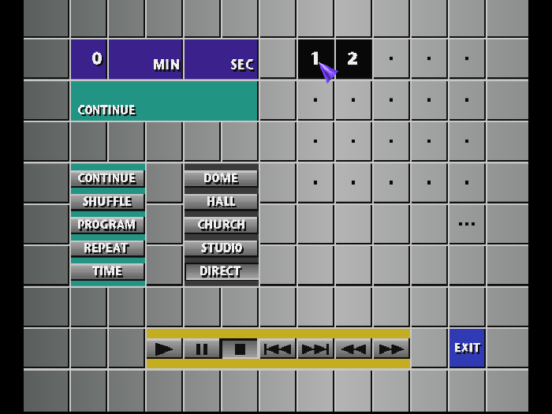

# Deconvolution example/test files

## Introduction

The Playstation SPU features a lo-fi reverberation effect

These audio files were made by recording the reverb presets from the PS1 CD Player using an emulator

The PS1 CD player has 4 reverberation presets :

* Dome
* Hall
* Church
* Studio

## Content of the directory

* "click.wav" is an impulse used as a cue for the start of the recording
* "sweep.wav" is a logarithmic sweep tone

Both were generated using IR tool

* "{preset}_click.wav" is the direct response from "click.wav"
* "{preset}_sweep.wav" is the response from "sweep.wav"
* "{preset}_sweep_deconvolved.wav" is the result of the deconvolution

Finally, ref_tone.7z contains a bin/cue binary image of a Red Book Audio CD with two tracks :

* Track 1 Impulse Click
* Track 2 Sweep

You can burn this image and play it with a real Playstation hardware (whose CD Player and menus greatly varies depending
on bios region and version) or directly use it with an emulator
You need a backup copy of your Playstation BIOS to use with it with an emulator

I used DuckStation with a SCPH-101 NTSC Bios image, DuckStation can directly log the audio output which is convenient

The impulse click from track 1 can be used as a cue to edit the audio files and get them all in perfect sync

## Settings

The following settings were used for the deconvolution :

* ☑ Deconvolve
* ☑ Trim End -99db
* ☑ Fade Out -90db
* ☑ Normalize "compensate"